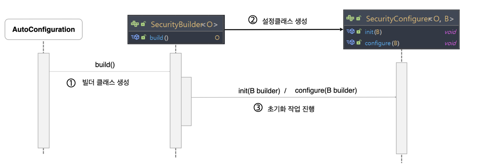
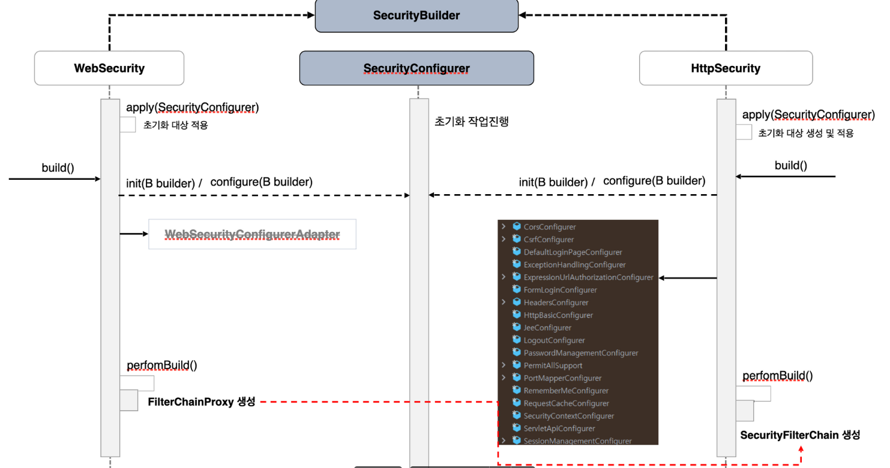
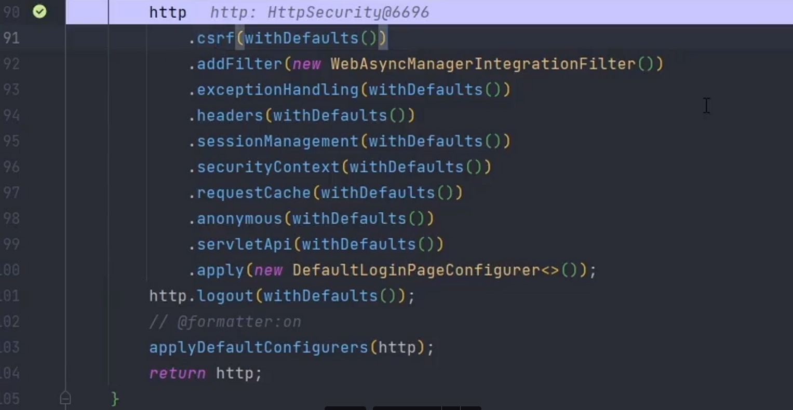
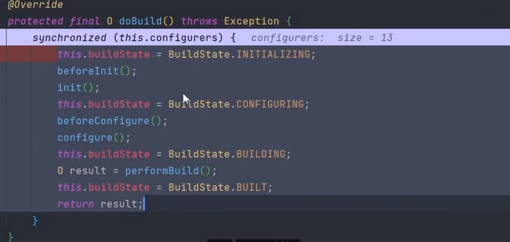

# 개념 및 구조 이해


- `SecurityBuilder` 는 빌더 클래스로서 웹 보안을 구성하는 빈 객체와 설정클래스들을 생성하는 역할을 하며 `WebSecurity, HttpSecurity`가 있다.
- `SecurityConfigurer` 는 Http 요청과 관련된 보안처리를 담당하는 **필터들을 생성**하고 여러 초기화 설정에 관여한다.
- `SecurityBuilder` 는 `SecurityConfigurer` 를 포함하고 있으며 인증 및 인가 초기화 작업은 `SecurityConfigurer`에 의해 진행된다.
- `SecurityBuilder` 클래스에는 build()라는 메소드가 있고 초기화 작업이 진행이 되면 자동호출에 의해 build()메소드 호출됨, 그리고 `SecurityConfigurer`에서 init() 과 configure() 메소드가 실행되고 필터들이 초기화 된다.




- AutoConfiguration 클래스 자동 설정에 의해 build()가 호출된다.
- 호출되는 과정에서 순서대로 클래스들이 호출되고 `SecurityConfigurer` 가 그 클래스들 사이에서 호출되어 init()과 configure() 가 실행된다.
- 결론 : `SecurityBuilder`가 `SecurityConfigurer`를 호출해서 실행시켜서 초기화 작업을 진행한다.




- `SecurityBuilder`에 대표적인 구현 클래스는 `WebSecurity` 와 `HttpSecurity`가 있다.
- WebSecurity가 먼저 초기화 작업을 한다.
- 두 개의 클래스에는 apply()메소드가 있는데 어떤 `SecurityConfigurer`를 초기화 대상 적용 시킨다.
- init 과 configure를 거치면서 filter들을 초기화 시킨다.
- 현재 버전에서는 `WebSecurityConfigureAdapter`가 deprecated가 됨
- 최종적으로 `WebSecurity`가 반환하는 거는 `FilterChainProxy`이다. `HttpSecurity`는 `SecurityFilterChain`을 생성한다.
- `FilterChainProxy`가 `SecurityFilterChain`의 값을 가지고 있다.


## CustomSecurityConfigurer 만들기

### 전반적인 과정 (디버그)

1. `WebSecurityConfiguration` (**SecurityBuilder 클래스의 구현체. 기본적으로 @Configuration 설정클래스임**) 먼저 171.Line 설정 클래스들을 가져와서 apply 해줌, apply 된 것들은 초기화 과정에서 init 과 configure 진행된다.
2. `HttpSecurityConfiguration` (**SecurityBuilder 클래스의 구현체. 기본적으로 @Configuration 설정클래스임**) prototype의 @Bean을 생성한다.



- 위의 API들은 각각의 설정클래스들의 구현체들을 생성하고 init과 configure 메소드를 실행할 수 있는 대상으로 지정하기 위한 과정.
3. SpringBootWebSecurityConfiguration 최종적으로 SecurityFilterChain 빈을 생성한다. SecurityFilterChain 클래스에서 위에서 반환했던 HttpSecurity를 주입 받는다.


4. 67.Line에서 build메소드를 호출하면 실제로 이런 설정 클래스들이 초기화 될 수 있도록 과정들이 진행된다. AbstractSecurityBuidler 클래스의 build() → doBuild() → AbstractConfiguredSecurityBuilder 의 doBuild()



- init() 실제 구현체들이 가지고있는 init메소드 호출 (13개의 configure)

- configure() 위와같다.

- 최종적으로 performBuild()를 호출해서 `DefaultSecurityFilterChain`을 반환한다. 그래서 3번에서 return 값이 만들어 진 것이다.
5. 반환된 `SecurityFilterChain` 는 `WebSecurityConfiguration` 에서 @Autowired해서


다시 websecurty.build() 를 하고 performBuild()를 통해 FilterChainProxy를 반환한다.

- 결론: `WebSecurity`와 `HttpSecurity` 를 통해 설정 클래스들이 만들어지고 init()과 configure() 메소드를 통해서 모든 설정 초기화 작업이 된다. 그리고 최종 산출물인 `SecurityFilterChain`객체(Bean)이 만들어지고 이 **Bean**을 최종적으로 사용하기 위한 클래스가 바로 `FilterChainProxy`이다. 그래서 FilterChainProxy를 리턴해서 `**SecurityBuilder**`를 완성한다. 그리고 이 Filter는 `“springSecurityFilterChain”` 이 이름으로 빈이 생선된다.


### 만들기

- 자동설정(기본적)으로 `SpringBootWebSecurityConfigureration`에서 만들고 있다.
- 기존에는 `public class SecurityConfig extends **WebSecurityConfigurerAdapter**`를 상속 받았었고 직접 인증 처리를 하였다
- 현재에는

```java
@Bean
SecurityFilterChain securityFilterChain(HttpSecurity http) {
    http.authorizeRequest().anyRequest().authenticated();
    http.formLogin();
    http.apply(new CustomSecurityConfigurer().setFlag(false)); --> (1)
    return http.build();
}
```

- 빈으로 등록하고 HttpSecuriy를 의존성 주입을 받는다. 기존과 비슷한 방식으로 하면된다.
- (1) 번과 같이 custom하게 만들어서 apply에 적용 시키면 된다.

- **`CustomSecurityConfigurer.java`**
  
  ```java
  public class CustomSecurityConfigurer extends AbstractHttpConfigurer<CustomSecurityConfigurer, HttpSecurity> { --(1)
          private boolean isSecure;
  
      @Override
      public void init(HttpSecurity builder) throws Exception {
          super.init(builder);
          System.out.println("init method started...");
      }
  
      @Override
      public void configure(HttpSecurity builder) throws Exception {
          super.configure(builder);
          System.out.println("configure method started...");
          if (isSecure) {
              System.out.println("http is required");
          } else {
              System.out.println("http is optional");
          }
      }
  
      public CustomSecurityConfigurer setFlag(boolean isSecure) { -- (2)
          this.isSecure = isSecure;
          return this;
      }
  }
  ```
  
  - (1)번은 AbstractHttpConfigurer 가 `AbstractHttpConfigurer<T extends AbstractHttpConfigurer<T, B>, B extends HttpSecurityBuilder<B>>` 제네릭 타입을 이런식으로 받는다.
  - 그 후 init() 과 configure() 메소드를 오버라이드 한다.
  - (2)번에서는 this를 return 하는데 위에 (1)번에서 계속해서 반환값을 configurer타입으로 받기 위해서 이다.
